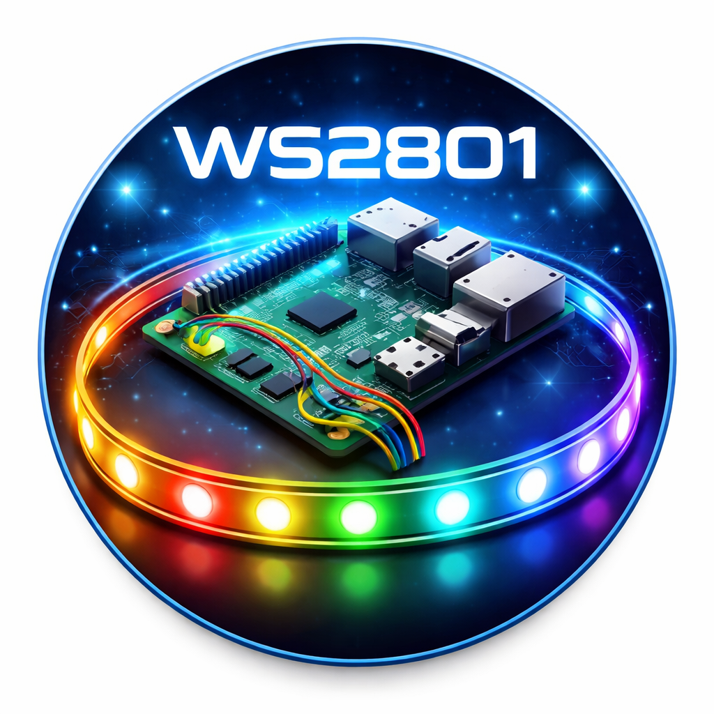

# WS2801 Kodi Addon

Control a WS2801 LED strip from Kodi on Raspberry Pi.

> [!CAUTION]
> Vibe-coded app! Use at your own risk!

## Features
- Set color
- Adjust brightness
- Uses SPI (GPIO)

## Requirements
- LibreELEC / Kodi 20+
- SPI enabled
- spidev available

## Installation
1. Zip folder:
   plugin.program.ws2801led/
2. Install via Kodi:
   Add-ons → Install from zip

## Hardware
- WS2801 LED strip
- Connected via SPI:
  - MOSI (GPIO10)
  - SCLK (GPIO11)

## Notes
- Run Kodi as root or ensure SPI permissions
